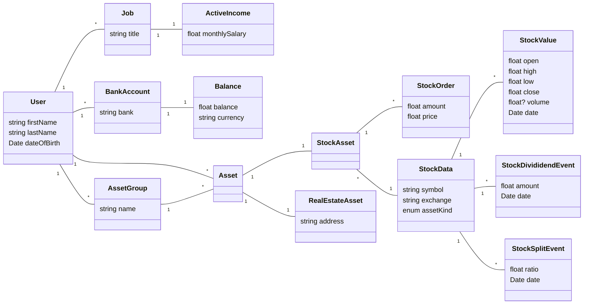

```mermaid
classDiagram
	direction LR
    class ActiveIncome{
        float monthlySalary
    }
    class Job{
		string title
    }
    class User{
		string firstName
		string lastName
		Date dateOfBirth
    }
    class BankAccount{
		string bank
    }
    class Balance{
		float balance
		string currency
    }
    class AssetGroup{
		string name
    }
    class Asset{

    }
    class StockAsset {
    }
	class StockOrder {
		float amount
		float price
	}
    class RealEstateAsset{
		string address
    }
    class StockData{
		string symbol
		string exchange
		enum assetKind
    }
    class StockValue {
		float open
		float high
		float low
		float close
		float? volume
		Date date
    }
	class StockDivididendEvent {
		float amount
		Date date
	}
	class StockSplitEvent {
		float ratio
		Date date
	}

    User "1" -- "*" Job
    Job "1" -- "1" ActiveIncome
    User "1" -- "*" BankAccount
    BankAccount "1" -- "1" Balance

    User "1" -- "*" AssetGroup
    User "1" -- "*" Asset
    AssetGroup "1" -- "*" Asset
    Asset "1" -- "1" StockAsset
    Asset "1" -- "1" RealEstateAsset
    StockAsset "*" -- "1" StockData
    StockData "1" -- "*" StockValue
	StockAsset "1" -- "*" StockOrder
	StockData "1" -- "*" StockDivididendEvent
	StockData "1" -- "*" StockSplitEvent


```